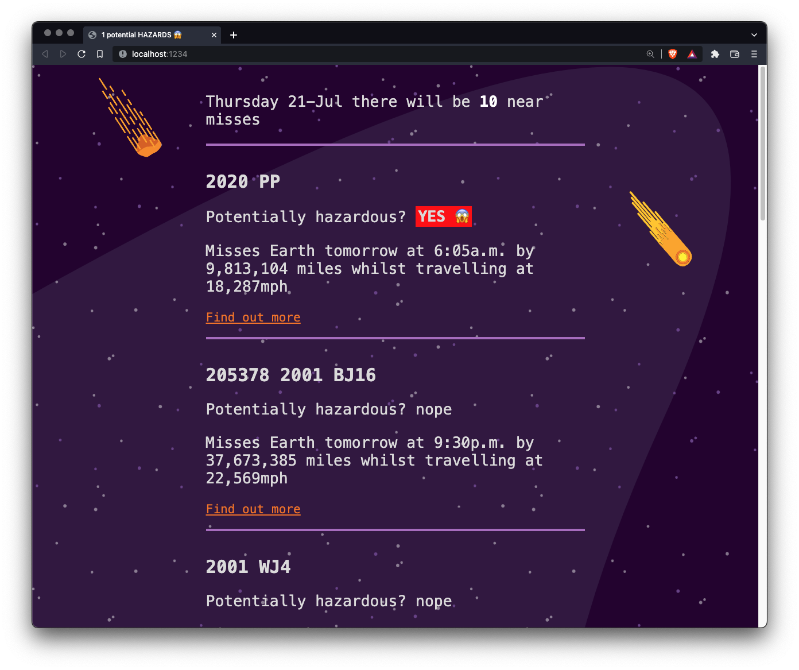

# Near misses

One case study on [NASA's open API](https://api.nasa.gov/) concerning potentially hazardous space objects threatening our existence on Earth. [live here](https://near-misses.netlify.app/)

